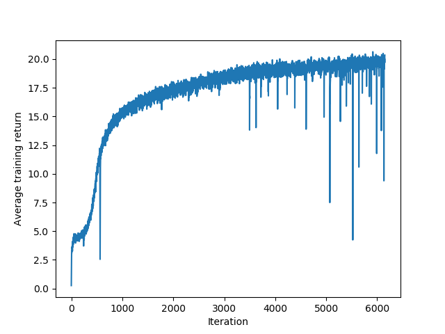

Performance report
==================


Commit `879854365e3f2a7dee073f8e1178f7b79f3db04f`.

# Performance

Average loss of last 100 training iterations: 19.40947426494126



# Diff

```
diff --git a/performance_logs/README.md b/performance_logs/README.md
index c18d13e..15be6f8 100644
--- a/performance_logs/README.md
+++ b/performance_logs/README.md
@@ -5,5 +5,3 @@ Self-play.
 
 | Commit | Average reward (last 100 iterations) | Number of iterations trained for |
 | ------ | ------------------------------------ | -------------------------------- |
-| [462e44c](././performance_logs/462e44c/report.md) | 19.40947426494126 | 6150 |
-| [e15a0d7](.././performance_logs/e15a0d7/report.md) | 19.40947426494126 | 6150 |
```
